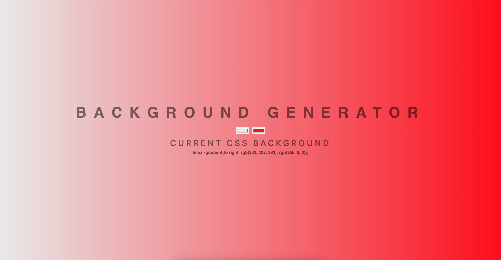

# background-generator

> A simple background generator which i made using JS. You can make a linear-gradient by clicking on the input and it will change the background according to the color you choose.
> And it will display the value of the linear-gradient in a paragraph tag.

